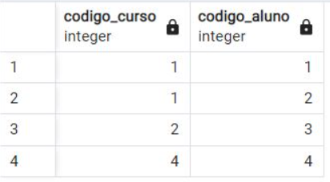
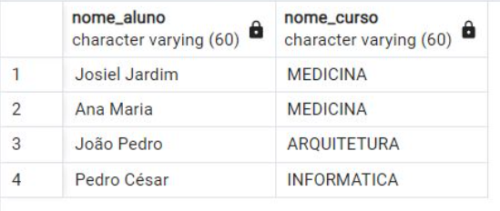
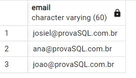
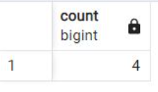
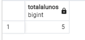
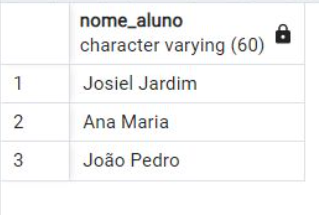
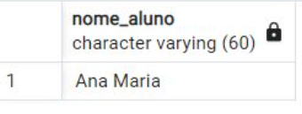
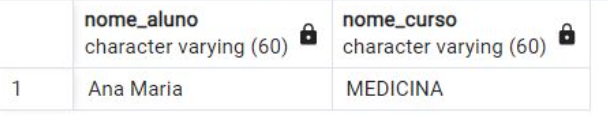
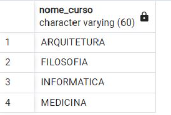
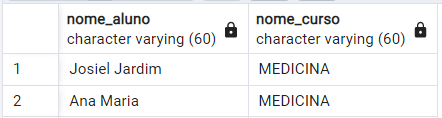

<h1> DataBase Test </h1>

This is a repository for my database test. If you want to interact with it, open the PostgreSQL on your computer and run the following codes.
Ps: some questions will be in portuguese, because it is equal the document of the test.

<h2> Creating the database </h2>

```
create database bdescola 
```

<h2> Creating the tables </h2>

Creating the table 'tb_aluno'
```
create table tb_aluno( 

codigo_aluno integer primary key, 

nome_aluno varchar(60) not null, 

ano_nascimento int, 

email varchar(60), 

sexo varchar not null 

)  
```
Creating the table 'tb_curso'
```
create table tb_curso( 

codigo_curso integer primary key, 

nome_curso varchar(60) not null 

) 
```
Creating the table 'tb_matricula'
```
create table tb_matricula( 

codigo_curso integer, 

codigo_aluno integer

) 

alter table tb_matricula

add constraint fk_codigo_curso foreign  key (codigo_curso) references tb_curso(codigo_curso) 

add constraint fk_codigo_aluno foreign  key (codigo_aluno) references tb_aluno(codigo_aluno) 
```

<h2> Inserting the data </h2>
<h4> Note: You have to change the values according to what the document requires. </h4>

Inserting the data of the table 'tb_aluno'
```
insert into tb_aluno (codigo_aluno, nome_aluno, ano_nascimento, email, sexo) 

values (3, 'João Pedro', 1979, 'joao@provasql.com.br', 'M') 
```
Inserting the data of the table 'tb_curso'
```
insert into tb_curso (codigo_curso, nome_curso) 

values (1, ‘MEDICINA’) 
```
Inserting the data of the table 'tb_matricula
```
insert into tb_matricula (codigo_curso, codigo_aluno)  

values (1, 1) 
```

<h1> Pratice Questions </h1>

<h2> Question 1 </h2>
<h4>Faça um comando SQL para matricular o aluno “Pedro César” no curso de
Informática. Os dados devem ser inseridos na tabela TB_MATRÍCULA.</h4>

```
insert into tb_aluno (codigo_aluno, nome_aluno, ano_nascimento, email, sexo) values (4, 'Pedro', null, null, 'M')
insert into tb_matricula (codigo_curso, codigo_aluno) values (4, 4)

select * from tb_matricula
```




<h2> Question 2 </h2>
<h4>Escreva um comando SQL que retorne os nomes dos alunos e do(s) cursos em
que estão matriculados. Os dados deverão estar ordenados pelo nome do curso.</h4>

```
select tb_aluno.nome_aluno, tb_curso.nome_curso from tb_aluno 
inner join tb_matricula on tb_aluno.codigo_aluno = tb_matricula.codigo_aluno
inner join tb_curso on tb_curso.codigo_curso = tb_matricula.codigo_curso
```




<h2> Question 3 </h2>
<h4>Crie um comando SQL que retorne o e-mail de todos os alunos maiores de idade.</h4>

```
select email from tb_aluno where 2022 - ano_nascimento >= 18
```



<h2> Question 4 </h2>
<h4>Desenvolva um comando SQL que mostre o total de alunos.</h4>

```
select count(cod_aluno) as total_alunos from tb_aluno
```




<h2> Question 5 </h2>
<h4>Escreva um comando SQL para listar o total de alunos matriculador em cada curso.</h4>

```
alter table tb_matricula
add codigo_matricula serial primary key 

```

```
select count(codigo_matricula) as total_alunos from tb_matricula group by codigo_curso
```



<h2> Question 6 </h2>
<h4>Desenvolva um comando SQL que retorne o nome de todos os alunos maiores que
18 anos.</h4>

```
select nome_aluno from tb_aluno where 2022 - ano_nascimento >= 18
```




<h2> Question 7 </h2>
<h4>Faça um comando SQL que retorne o nome de todas as mulheres.</h4>

```
select nome_aluno from tb_aluno where sexo = 'F'
```




<h2> Question 8 </h2>
<h4>Faça um comando SQL que retorne o nome de todas as mulheres matriculadas
no curso de Medicina.</h4>

```
select nome_aluno, tb_curso.nome_curso as nome_curso from tb_aluno
inner join tb_curso on tb_curso.nome_curso = 'MEDICINA'
where sexo = 'F' 
```



<h2> Question 9 </h2>
<h4>Faça um comando SQL que retorne os nomes dos cursos ordenados por ordem
alfabética.</h4>

```
select nome_curso from tb_curso order by nome_curso
```




<h2> Question 10 </h2>
<h4>Crie o enunciado de uma consulta SQL que utilize “junção” (com resposta).</h4>
Selecione o nome e o curso dos alunos de sexo masculino que estão matriculados no curso de arquitetura.

```
select tb_aluno.nome_aluno, tb_curso.nome_curso from tb_aluno 
inner join tb_matricula on tb_aluno.codigo_aluno = tb_matricula.codigo_aluno
inner join tb_curso on tb_curso.codigo_curso = 1
```



<h1> Theoretical Questions </h1>

<h2> Question 1 </h2>
  A sigla SQL significa “Structured Query Language”, que, em português, quer dizer: “Linguagem de Consulta Estruturada”, é uma linguagem padrão para trabalhar com bancos de dados relacionais. Ela é uma linguagem declarativa e que não necessita de profundos conhecimentos de programação para que alguém possa começar a utilizá-la. 

  É uma linguagem fundamental para qualquer profissional que trabalhe com dados, sendo ainda mais usada do que Python e R. E que, devido a sua simplicidade, não é necessário ser um programador para aprendê-la. Com isso, cada vez mais áreas têm sido exigido o conhecimento em SQL como complementar em tarefas cotidianas.

<h2> Question 2 </h2>
Mind map about the history of SQL.


<h2> Question 3 </h2>
  Trata-se de uma linguagem com palavras-chave em inglês, e formato livre (com relação à identificação, quebra de linhas, etc.) e livremente baseada na Teoria dos Conjuntos, isto é, as tabelas onde constam as informações são tratadas como conjuntos, onde são aplicadas operações de intercessão, união, seleção, etc. 

  Suas principais funções: 

   Analíticas: Computam um valor agregado com base em um grupo de linhas. Podemos usar funções analíticas para calcular médias móveis, totais acumulados, percentuais ou os primeiros N resultados de um grupo. 

  Manipulação de bits: permitem processar e armazenar dados com mais eficiência do que com bits individuais. 

  Classificação: Retornam um valor de classificação para cada linha em uma partição. Dependendo da função usada, algumas linhas podem receber o mesmo valor que outras. 

  Conjunto de linhas: Retornam um objeto que pode ser usado como referências de tabela em uma instrução SQL. 

  Escalares: Funcionam em um valor único e retornam um valor único. As funções escalares podem ser usadas onde uma expressão é válida. 

<h2> Question 4 </h2>
  O comando SELECT é utilizado para extrair os dados das tabelas de um banco de dados. Ele pode extrair dados de uma ou mais tabelas ao mesmo tempo, executando desde simples consultas até comandos mais complexos, fazendo buscas, junções, filtros comparativos, ordenações e diversos outros itens. As principais cláusulas são:  

  FROM: Especifica as tabelas ou consultas que contêm os campos listados na instrução SELECT. 

  WHERE: A cláusula WHERE é a responsável por filtrar resultados, utilizando parâmetros comparativos como igual, diferente, maior, menor e entre outros. Além disso, podemos usar diversos filtros em nossas consultas, inclusive adicionar parênteses para priorizar consultas dentro de escopos. 

  ORDER BY: Serve para ordenar os resultados com a cláusula ORDER BY. A cláusula ORDER BY deve ser inserida após as cláusulas anteriores. O modo ascendente (ASC) é o padrão do ORDER BY, indo do menor para o maior. Porém, contém também o modo decrescente (DESC), indo do maior para o menor.

<h2> Question 5 </h2>
  SQL (Structured Query Language) é a linguagem padrão universal para manipular bancos de dados relacionais através dos SGBDs (Sistema de Gerenciamento de Banco de Dados Relacionais). Isso significa que todos os SGBDRs oferecem uma interface para acessar o banco de dados utilizando a linguagem SQL, embora com algumas variações. Logo, saber o que é SQL e como utilizá-la é fundamental para qualquer desenvolvedor de softwares. 

   Quem quer trabalhar em qualquer área que contenha manipulação de dados, precisa aprender a SQL, pois a maioria dos sistemas de informação interage com banco de dados; e essa é a linguagem universal para fazer qualquer coisa nos bancos de dados relacionais (o tipo de banco de dados mais utilizado na indústria). Pode haver pequenas variações na linguagem dependendo do SGBD, mas a sintaxe dos comandos é muito parecida. 

